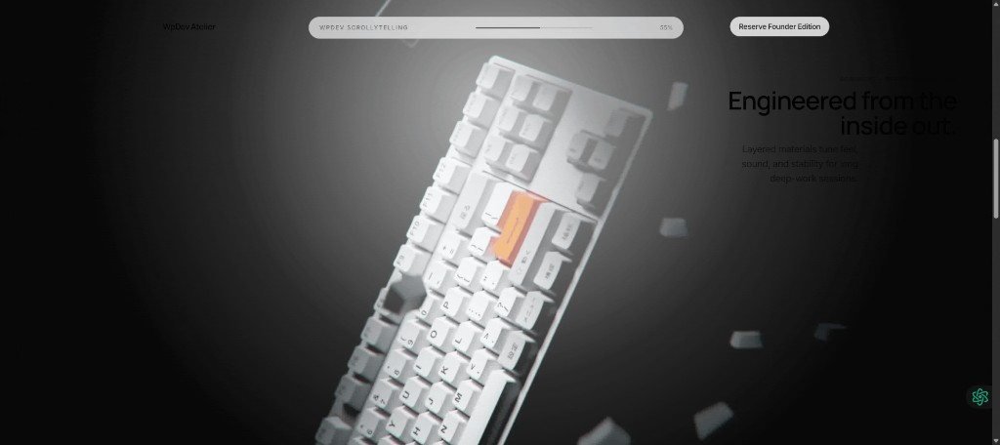

# WpDev Keyboard Landing Page

High-end scrollytelling landing page for a fictional keyboard brand, built with Next.js 14, Framer Motion, Tailwind CSS, and Canvas-based image sequence rendering.

## Preview



- Cinematic scroll-driven keyboard animation
- Premium editorial light + dark sections
- Conversion-focused product storytelling
- Responsive layout with sticky canvas and sales sections

## Tech Stack

- **Framework:** Next.js 14 (App Router)
- **Language:** TypeScript
- **Styling:** Tailwind CSS
- **Animation:** Framer Motion
- **Rendering:** HTML5 Canvas

## Project Structure

```text
app/
  layout.tsx
  page.tsx
  globals.css
components/
  KeyboardScroll.tsx
public/
  ezgif-frame-001.jpg ... ezgif-frame-290.jpg
```

## Getting Started

### 1) Install dependencies

```bash
npm install
```

### 2) Run development server

```bash
npm run dev
```

Open [http://localhost:3000](http://localhost:3000).

### 3) Production build

```bash
npm run build
npm run start
```

## Image Sequence Configuration

The animation sequence is configured in `components/KeyboardScroll.tsx`.

- `TOTAL_FRAMES` controls frame count (currently `290`)
- `resolveFrameSource()` maps frame index to image file path
- Current naming convention:
  - `public/ezgif-frame-001.jpg`
  - ...
  - `public/ezgif-frame-290.jpg`

If you replace frames, update `TOTAL_FRAMES` and/or `resolveFrameSource()` accordingly.

## Scripts

- `npm run dev` - start local dev server
- `npm run build` - create production build
- `npm run start` - start production server
- `npm run lint` - run lint checks

## Deployment

This project can be deployed to Vercel or any Node.js hosting provider.

### Vercel (recommended)

1. Push this repository to GitHub
2. Import the repo in Vercel
3. Deploy with default Next.js settings

## License

This project is for portfolio/demo purposes.

